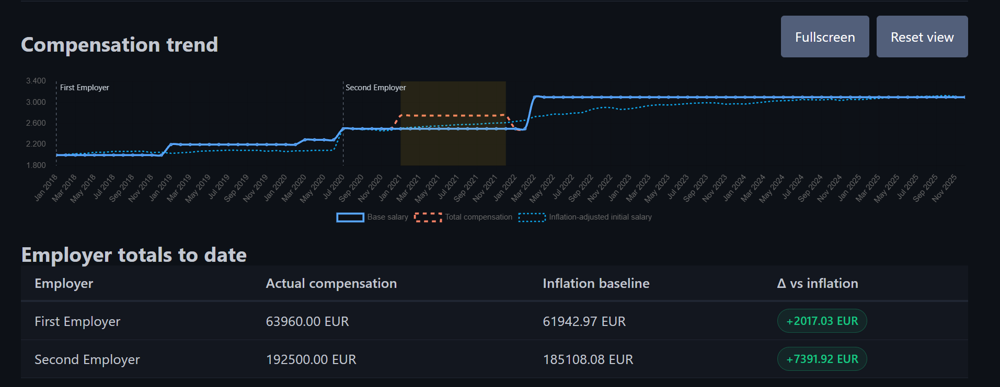
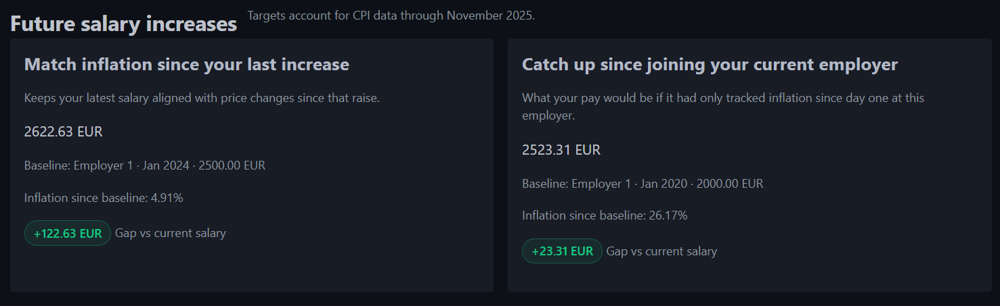

# Salary Tracker

A lightweight Django web application for tracking salary history across multiple employers. You can log raises and bonuses, visualize trends, compare your salary to inflation and keep track on all of that



## Features
- Employer management and salary entries (regular raises + time-bound bonuses).
- Compare salary development to inflation (ECB HICP data for every EU member state)

## Quick Start (Docker)
1. Copy the sample environment file and adjust values:
   ```bash
   cp .env.example .env
   ```
   Set a strong `DJANGO_SECRET_KEY`

2. Build and run the container:
   ```bash
   docker compose up --build
   ```

3. Open http://localhost:8000 and log create your initial user. 

5. Go to admin settings and add an inflation index. Data will download automatically.
6. Go to your personal settings and apply the inflation index you just added
6. Add employers and salary entries from the dashboard. The chart updates immediately based on the stored data.

## Ready to use docker-compose 
```
services:
  web:
    image: ghcr.io/steve192/salary-tracker
    ports:
      - "8000:8000"
    env_file:
      - .env
    environment:
      DJANGO_DB_PATH: /app/data/db.sqlite3
    volumes:
      - sqlite-data:/app/data
    restart: unless-stopped

volumes:
  sqlite-data:
```

Make sure you also use the .env.example (copy it to .env and populate the settings)

### Useful Docker Environment Variables
| Variable | Description | Default |
| --- | --- | --- |
| `DJANGO_SECRET_KEY` | Secret key for Django session signing—always override in production. | `insecure-change-me` |
| `DJANGO_DEBUG` | Enables Django debug features and auto-reload; keep `false` in production. | `false` |
| `DJANGO_ALLOWED_HOSTS` | Comma-separated hostnames accepted when `DJANGO_DEBUG=false`. | `*` |
| `DJANGO_CSRF_TRUSTED_ORIGINS` | HTTPS origins allowed for CSRF-protected requests (needed behind reverse proxies). | unset |
| `DJANGO_TIME_ZONE` | Forces backend timezone; falls back to the host timezone if unset. | system tz |
| `DJANGO_DB_PATH` | SQLite path; Compose defaults to `/app/data/db.sqlite3` for persistence. | `<project>/db.sqlite3` |
| `DJANGO_FORCE_SCRIPT_NAME` | URL prefix when hosting under a sub-path (e.g., `/salary`). | unset |
| `DJANGO_STATIC_URL` | Static asset base URL; override for CDNs or when `DJANGO_FORCE_SCRIPT_NAME` is set. | derived |
| `DJANGO_MEDIA_URL` | Media asset base URL; override for CDNs or when `DJANGO_FORCE_SCRIPT_NAME` is set. | derived |
| `DJANGO_LOG_LEVEL` | Console logging verbosity (`DEBUG`, `INFO`, etc.). | `INFO` |
| `DJANGO_ALLOW_SELF_REGISTRATION` | Enables the public `/accounts/register/` form; keep `false` to require admins to onboard users manually. | `false` |
| `GUNICORN_WORKERS` | Gunicorn worker process count. | `3` |

## Local Development (without Docker)
Python 3.12+ is required (see `pyproject.toml`).
```bash
python -m venv .venv
source .venv/bin/activate
pip install --upgrade pip
pip install -e .
cp .env.example .env  # adjust values as needed
python manage.py migrate
python manage.py runserver
```

During local development you can leave `DJANGO_DB_PATH` unset to keep the SQLite file at the project root. Static assets are served via Django + Whitenoise, so no extra tooling is needed.

Dependencies are managed via `pyproject.toml` (no `requirements.txt`).

## Desktop App (Electron, local-only)
This runs the Django backend locally and opens it inside an Electron window. Docker distribution remains unchanged.
The desktop wrapper sets `DJANGO_DESKTOP_MODE=true` so a local default user is created and auto-signed in.

1. Prepare the backend once (from the repo root):
   ```bash
   python -m venv .venv
   source .venv/bin/activate
   pip install -e .
   ```
2. Install the Electron wrapper (from the repo root):
   ```bash
   cd desktop
   npm install
   ```
3. Launch the desktop app:
   ```bash
   cd desktop
   npm run dev
   ```

The desktop build uses `npm ci` in CI for reproducible installs, so keep `desktop/package-lock.json` committed.

If you're using a virtualenv, activate it before running `npm run dev`, or set the Python path explicitly:
```bash
PYTHON=../.venv/bin/python npm run dev
```

Data is stored in your OS user data directory (`db.sqlite3`). To reset the app, delete that file.

### Build desktop executables
Run the build on the target OS.

- Linux:
  ```bash
  ./desktop/scripts/build-linux.sh
  ```
- Windows (PowerShell):
  ```powershell
  powershell -ExecutionPolicy Bypass -File desktop\\scripts\\build-windows.ps1
  ```

Artifacts are written to `desktop/dist/` (AppImage on Linux, portable `.exe` on Windows).
The Linux build script uses the Python version declared in `pyproject.toml` and will download/build it via `pyenv` (with shared libs) if needed.
If it needs to compile Python, install build dependencies first (Debian/Ubuntu example):
```bash
sudo apt-get update && sudo apt-get install -y \
  build-essential libssl-dev zlib1g-dev libbz2-dev libreadline-dev \
  libsqlite3-dev libffi-dev liblzma-dev tk-dev uuid-dev
```
The Windows build script uses the Python version declared in `pyproject.toml` and will install it via `pyenv-win` if needed (requires `git`).
